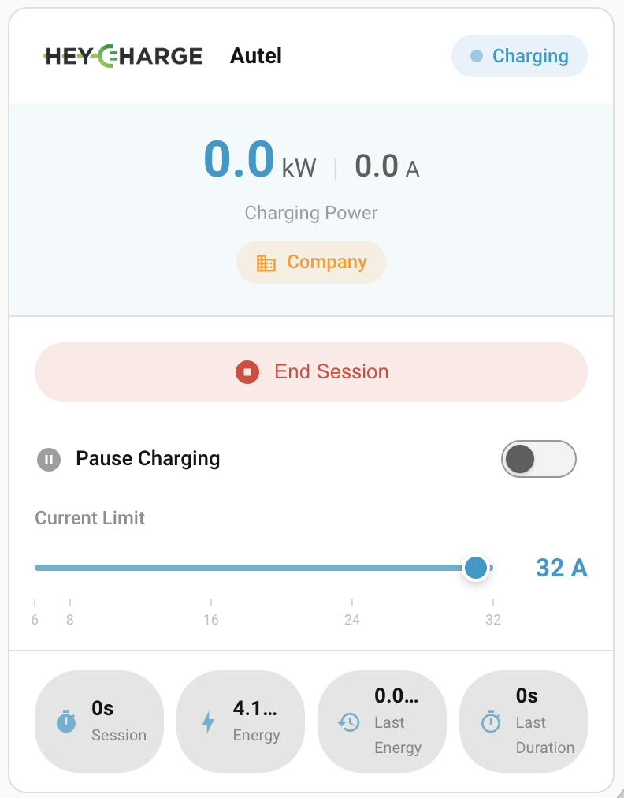

# HeyCharge Card for Home Assistant

A Lovelace card for controlling and monitoring your [HeyCharge CONNECT](https://heycharge.com/) device — pairs with the [HeyCharge CONNECT integration for Home Assistant](../integration/) and works with the [CONNECT Bridge](https://heycharge.com/products/connect-bridge) and [CONNECT MagicBox](https://heycharge.com/products/consumer-gateway).



## Features

- **Real-time monitoring** -- live power, current, and energy tracking with animated indicators
- **Full control** -- start/stop sessions, adjust current limit, pause charging
- **Company car mode** -- separate personal and company session buttons
- **Statistics** -- current and last session energy, duration, and current request
- **Advanced view** -- per-phase currents and charger state details
- **Responsive** -- optimized for mobile, tablet, and desktop
- **Theme integration** -- follows your Home Assistant theme automatically
- **Visual config editor** -- built-in card editor for easy setup

## Prerequisites

- Home Assistant 2023.1.0 or newer (HA 2026.3+ to render the integration's bundled brand icons)
- [HeyCharge CONNECT integration](../integration/) installed and configured
- A [CONNECT Bridge](https://heycharge.com/products/connect-bridge) (running OCPP Translator firmware) or [CONNECT MagicBox](https://heycharge.com/products/consumer-gateway) (running Consumer Gateway firmware) — both expose the local HTTP API the card and integration depend on

## Installation

### Manual

1. Copy the `dist/` contents to your Home Assistant config:

```bash
mkdir -p /path/to/homeassistant/config/www/heycharge-card
cp dist/heycharge-card.js /path/to/homeassistant/config/www/heycharge-card/
cp dist/heycharge-card-editor.js /path/to/homeassistant/config/www/heycharge-card/
cp -r dist/assets /path/to/homeassistant/config/www/heycharge-card/
```

2. Add the resource to your Lovelace configuration:

```yaml
resources:
  - url: /local/heycharge-card/heycharge-card.js
    type: module
```

3. Restart Home Assistant and clear your browser cache (Ctrl+F5)

### HACS

1. Open HACS in your Home Assistant instance.
2. Click the three-dot menu in the top-right → **Custom repositories**.
3. Add the URL `https://github.com/heycharge-hq/lovelace-heycharge-card` and pick **Dashboard** as the type.
4. Click **Download** on the new "HeyCharge Card" entry.
5. Hard-refresh your browser (Cmd/Ctrl + Shift + R).

## Configuration

### Basic (Auto-detection)

The card finds your HeyCharge entities automatically by looking for any entity with `platform: heycharge` in HA's entity registry. No config needed:

```yaml
type: custom:heycharge-card
```

### Full Configuration

```yaml
type: custom:heycharge-card
show_company_mode: true               # Show personal/company session buttons
show_statistics: true                 # Show energy statistics section
show_advanced: false                  # Show advanced details section
compact_mode: false                   # Use compact layout for small cards
entity_prefix: sensor.garage_         # Optional override (rare; see below)
```

### Configuration Options

| Option | Type | Default | Description |
|--------|------|---------|-------------|
| `show_company_mode` | boolean | `true` | Show separate personal/company session buttons (only relevant when company car mode is enabled in the gateway) |
| `show_statistics` | boolean | `true` | Display session energy and duration stats |
| `show_advanced` | boolean | `false` | Show per-phase currents and charger state details |
| `compact_mode` | boolean | `false` | Compact layout for smaller dashboard areas |
| `entity_prefix` | string | (auto) | Override only if auto-detect fails — e.g. you renamed entities or are using legacy MQTT discovery. Card prefers the registry-based detect when this is unset. |
| `device_id` | string | (auto) | Manual device ID hint. Rarely needed; auto-detect picks one when the entity registry has any HeyCharge entity. |

## Entity Mapping

The card reads entities created by the [HeyCharge CONNECT integration](../integration/). With the integration's `_attr_has_entity_name = True`, HA derives entity IDs from the device name plus the entity key — e.g. a device named "Garage" produces `sensor.garage_charging_power`, `switch.garage_pause_charging`, etc. The card auto-discovers them by looking up `platform: heycharge` in the entity registry, so the exact prefix doesn't matter.

### Required Entities

| Entity ID Pattern | Integration Key | Used For |
|-------------------|-----------------|----------|
| `switch.*_pause_charging` | pause_charging | Pause/resume toggle |
| `sensor.*_charging_power` | charging_power | Main power display |
| `number.*_current_limit` | current_limit | Current limit slider |
| `sensor.*_charger_state` | charger_state | Status indicator |

### Optional Entities

| Entity ID Pattern | Integration Key | Used For |
|-------------------|-----------------|----------|
| `sensor.*_current_request` | current_request | Current request display |
| `sensor.*_charging_current_l1` | charging_current_l1 | Phase 1 current (advanced) |
| `sensor.*_charging_current_l2` | charging_current_l2 | Phase 2 current (advanced) |
| `sensor.*_charging_current_l3` | charging_current_l3 | Phase 3 current (advanced) |
| `sensor.*_energy_delivered` | kwh_delivered | Session energy stat |
| `sensor.*_last_session_energy` | last_session_energy | Previous session stat |
| `sensor.*_last_session_duration` | last_session_duration | Previous session stat |
| `sensor.*_session_duration` | current_session_duration | Current session stat |
| `sensor.*_session_type` | session_type | Personal/company badge |
| `button.*_start_session` | start_session | Start button |
| `button.*_start_session_personal` | start_session_personal | Personal start button |
| `button.*_start_session_company` | start_session_company | Company start button |
| `button.*_end_session` | end_session | Stop button |

## Card Sections

### Header
Shows charger name, connection status indicator, and current charger state (Charging, Idle, Error, etc.).

### Main Status
Large power reading in kW with approximate amps. When company car mode is active, shows a Personal/Company badge.

### Controls
- **Start Session** buttons (single or personal+company depending on mode)
- **Stop Session** button (visible when session active)
- **Pause Charging** switch
- **Current Limit** slider (6-32A with tick marks)

### Statistics
- Current session energy and duration
- Last session energy and duration
- Current request from the EV

### Advanced (hidden by default)
- Charger state text
- Per-phase current readings (L1, L2, L3)

## Theming

The card follows your Home Assistant theme. You can customize HeyCharge-specific colors via theme variables:

```yaml
heycharge-card:
  heycharge-green: "#00C853"
  heycharge-green-light: "#5EFC82"
  heycharge-green-dark: "#009624"
  personal-blue: "#2196F3"
  company-purple: "#9C27B0"
```

## Troubleshooting

### Card Not Showing

1. Clear browser cache (Ctrl+F5)
2. Check browser console (F12) for JS errors
3. Verify the resource is listed in **Settings > Dashboards > Resources**
4. Ensure the JS file is at the correct path under `config/www/`

### Entities Not Detected

1. Verify the HeyCharge integration is installed and connected to your CONNECT device
2. Check that entities exist in **Developer Tools > States**
3. Try specifying `device_id` manually in the card config
4. Adjust `entity_prefix` if your entity naming differs

### Controls Not Responding

1. Check that the gateway is reachable on the network
2. Look at Home Assistant logs for API errors
3. Verify entity permissions
4. Test controls via **Developer Tools > Services** (e.g. `button.press`)

### Slider Snapping Back

The card uses a 5-second latch on the current limit slider to prevent the value from snapping back to the firmware-reported value while you're adjusting it. If it still snaps back, the firmware may be rejecting the value (check logs).
